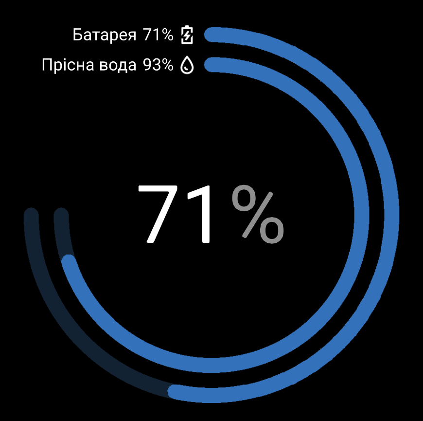

# T-CAN485 Tank Bridge

<p align="center">
  
</p>

ESP32 firmware that reads a water-level sensor over RS485 (Modbus RTU) and
republishes the value to a Victron Cerbo GX two ways:

- **NMEA 2000** — PGN 127505 (Fluid Level, type Water) over VE.Can.
- **BLE** — Mopeka Pro Check H2O–compatible advertisement, so the Cerbo GX
  discovers it as a Bluetooth tank sensor.

Either path can be enabled independently from the web UI.

> **Disclaimer.** This project is not affiliated with, endorsed by, or
> sponsored by Mopeka Products LLC. "Mopeka" and "Pro Check" are trademarks of
> their respective owners. The BLE advertisement format used by this firmware
> was learned from publicly documented community reverse-engineering work
> (see [Acknowledgements](#acknowledgements)).

## Hardware

[LilyGo T-CAN485](https://github.com/Xinyuan-LilyGO/T-CAN485) — ESP32 board
with:

- CAN bus (SN65HVD231 via TWAI)
- RS485 (MAX13487EESA+)
- WS2812B status LED
- SD card slot (unused by this firmware)
- WiFi + BLE

The vendored upstream LilyGo repo lives at `T-CAN485/` as a git submodule
(pinned). We pull `pin_config.h` and FastLED from its `lib/` via PlatformIO's
`lib_extra_dirs`.

## Layout

```
canrs485/
├── platformio.ini
├── src/                Tank Bridge firmware
├── scripts/            build_index_html.py pre-build hook
├── docs/               sensor + Cerbo GX reference PDFs
└── T-CAN485/           submodule, vendored upstream (pin_config.h, FastLED)
```

## Build

Requires [PlatformIO Core](https://docs.platformio.org/en/latest/core/installation/index.html).

```bash
git clone --recursive https://github.com/metasov/T-CAN485-cerbo-water-tank.git
cd T-CAN485-cerbo-water-tank
pio run                          # build
pio run --target upload          # build + flash over USB
pio device monitor               # serial monitor at 115200 baud
```

If you cloned without `--recursive`:

```bash
git submodule update --init --recursive
```

### First flash

NVS persists across re-uploads. To wipe saved WiFi creds and start with the
default password regenerated at boot:

```bash
pio run -t erase && pio run -t upload
```

If flashing fails, hold **BOOT-0**, briefly press **EN/RST** (release RST,
keep holding BOOT-0), release BOOT-0 a moment later, then retry. Close the
serial monitor first.

## First-boot setup

1. The board comes up as a WiFi access point named **TankBridge-XXXX**. The
   admin password prints on the serial console at 115200 baud (regenerated on
   every boot until you change it via the web UI).
2. Connect to the AP — your phone or laptop is captive-portal-redirected to
   the setup page.
3. Pick your home WiFi from the scan list, enter its password, save.
4. Once the board joins your network, reach the dashboard at
   **http://watertank.local/** (mDNS).
5. Sign in with `admin` and the password from the serial console; change it
   from the dashboard.
6. Configure the sensor: tank capacity, sensor range, Modbus address. Use the
   **Probe** wizard if you don't know the protocol.
7. Enable NMEA 2000 and/or BLE output as desired.

## OTA updates

Once the firmware is running, subsequent updates can be pushed over WiFi:

```bash
pio run
curl -u admin:<password> -F "file=@.pio/build/esp32dev/firmware.bin" \
     http://watertank.local/api/ota
```

The device reboots ~500 ms after the response. NVS settings survive the
update.

## Documentation

- `CLAUDE.md` — architecture, pin map, gotchas (intended for AI coding
  assistants but also useful as a developer reference).
- `docs/docs/mopeka_ble_protocol.md` — reverse-engineered Mopeka
  Pro Check H2O BLE advertisement format consumed by Victron's
  `dbus-ble-sensors`.
- `docs/sensor.pdf` — water-level sensor datasheet.
- `docs/140558-Ekrano_GX__Venus_GX__Cerbo_GX__Cerbo-S_GX_Manual-pdf-en.pdf` —
  Cerbo GX manual (NMEA 2000 + Bluetooth tank-sensor sections).

## Acknowledgements

The Mopeka BLE advertisement format consumed by Victron's Cerbo GX is not
officially published; the byte layout used by this firmware was derived from
publicly available community reverse-engineering work and from the open-source
consumer side. Credit and thanks to:

- [`victronenergy/dbus-ble-sensors`](https://github.com/victronenergy/dbus-ble-sensors) —
  the Cerbo GX daemon that ingests these advertisements; the definitive source
  of truth for what the GX accepts.
- [`spbrogan/mopeka_pro_check`](https://github.com/spbrogan/mopeka_pro_check) —
  early Python implementation; one of the first public decoders.
- [ESPHome `mopeka_pro_check` component](https://esphome.io/components/sensor/mopeka_pro_check/) —
  byte-level parser and reference implementation.
- [Theengs Decoder — Mopeka entry](https://decoder.theengs.io/devices/Mopeka.html) —
  community decoder catalogue.
- [`Bluetooth-Devices/mopeka-iot-ble`](https://github.com/Bluetooth-Devices/mopeka-iot-ble) —
  Home Assistant integration path; service-UUID validation reference.
- [LilyGo T-CAN485 reference repo](https://github.com/Xinyuan-LilyGO/T-CAN485) —
  pin map and FastLED bundle (vendored as a submodule under `T-CAN485/`).

The Mopeka protocol notes in `docs/docs/mopeka_ble_protocol.md` distil what
those projects collectively document; cross-reference there for the byte-level
detail and the rationale behind every field.

## License

[MIT](LICENSE).
